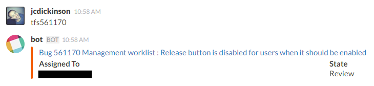

## TFS Slack Bot

A quick and dirty TFS [Slack](http://slack.com/) bot. Its quite rushed as it was done between work. It does, however, get the job done.

## Installation

Open up SlackBotService.exe.config and make the following edits:

 * `<client token="" />`
   * Put your [slack bot integration token](https://api.slack.com/bot-users)
     into the token attribute.
 * `<add name="tfs" projectCollection="" project=""/>`
   * Put your project collection into the projectCollection attribute:  (e.g.
     `http://mytfs:8080/tfs/MyCollection`)
   * Fill in the project attribute.

Open up an elevated command prompt and `cd` to the directory, then run:

    installutil /i slackbotservice.exe
    net start slackbotservice

Make sure you use an account with access to TFS for the service account. Keep
an eye on the Windows event log the first time you run it: it will report
status and errors there. Invite your bot to a room and type in a TFS item (e.g.
tfs123456).

Note that when `installutil` prompts for the username you need to put
`.\username` ([more info](http://stackoverflow.com/a/2205777/10245))

This stuff is beyond alpha so you may need to restart it from time to time.

### Contributing

**Getting started with Git and GitHub**

 * People new to GitHub should consider using [GitHub for Windows](http://windows.github.com/).
 * If you decide not to use GHFW you will need to [set up Git and connect to GitHub](http://help.github.com/win-set-up-git/).
 * [Fork the TFS Slack Bot repository](http://help.github.com/fork-a-repo/).
 * Finally you should look into [git - the simple guide](http://rogerdudler.github.com/git-guide/).

**Rules for Our Git Repository**

 * We're here to have fun.
   * Seriously, have fun.
   * Check out the [Code of Conduct](code_of_conduct.md).
   * No matter how small a contribution is, or how much work it needs, we are grateful.
 * The coding standards aren't strict at all, but when in Rome be a Roman: take a look at how the code is written and *try* to stick to that.
   * Just one thing: 4 spaces, not tabs.

### License

TFS Slack Bot is licensed under the MIT license, which can be found in [LICENSE](LICENSE).

**Additional Restrictions**

 * We only accept code that is compatible with the MIT license.
 * Copying copy-left (e.g. GPL) code is strictly forbidden.
